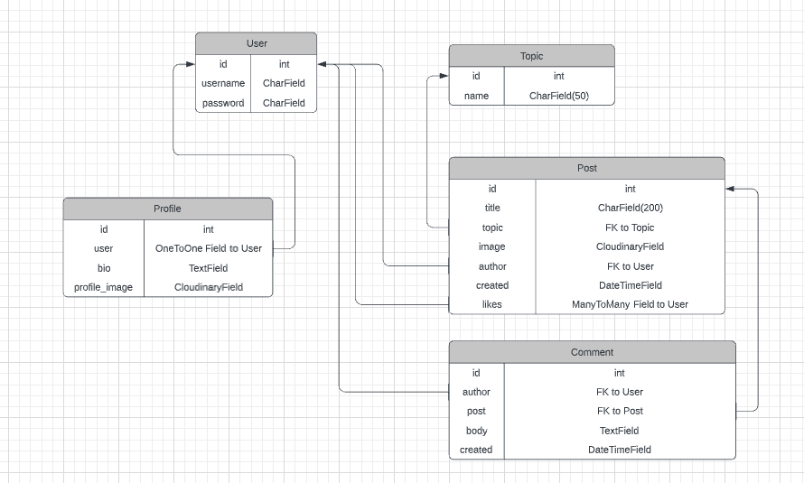
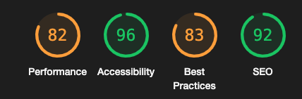

# 8GAG - [Live link](https://msp4-8gag.herokuapp.com/)

If you want to laugh and enjoy some good memes, you have come to the right place! 

8GAG is a fully responsive meme website, based on a very popular meme page called 9GAG. 
It is a place where users can create a profile, share their best memes, comment and like on other people's memes, or simply have a fun time.

## User Experience

### EPICs --> User Stories

In the following section I will describe my EPICs for this project and the user stories derived from each EPIC.

(MH - Must Have, SH - Should Have, CH - Could Have)

### 1. User authentication/authorisation 
- As a site visitor, I want to be able to register/login with username/password to become a user, so that I can access special functionalities on the page (MH)
- As a site visitor, I want to be able to create an account with personal information about me, so that I have a personalized profile (MH)
- As a site visitor/user, I want to be constantly updated about my login status or informed about errors, so that I can see what state I am browsing the page in (MH)
- As a user, I want to be able to reset my password/username, so that I do not lose my account in case I forgot one of them (CH)
- As a site visitor, I can register or log in with my social accounts, so that I do not need to create a new account only for this page (CH)

### 2. Browse Site
- As a site visitor, I want to be able to browse the feed and see all the latest memes in chronological order, so that I can enjoy the page without being logged in (MH)
- As a site visitor, I want to be able to filter for certain categories of memes, so that I can only see memes that interest me (MH)
- As a site visitor, I want to be able to click on a post to see its comments, so that I can see what others have to say about the post (MH)
- As a site visitor, I want to see the number of likes/comments on each post in the feed, so that I can see right away if a meme is funny/popular (MH)
- As a site visitor, I can see dislikes on each post in the feed, so that I can see right away if other users did not like a meme (SH)
- As a site visitor, I can search for certain words in the post title, so that I can find very specific posts (SH)
- As a logged-in user, I can participate in chat rooms regarding certain topics, so that I can discuss with other users about a topic I am interested in (CH)

### 3. Post a Meme
- As a logged-in user, I want to be able to create and delete a post with a picture, so that I can share my memes with others (MH)
- As a logged-in user, I can also upload videos, so that I can enjoy and post funny videos too (CH)

### 4. Likes/Comments
- As a logged-in user, I want to be able to create and delete comments, so that I can interact with other people's memes (MH)
- As a logged-in user, I want to be able to like and unlike a post, so that I can interact with other people's memes and show them my appreciation (MH)
- As a logged-in user, I can downvote posts, to show that I dislike another meme (SH)

### 5. Profile Section
- As a logged-in user, I want to see my profile information in a special section next to the feed, so that I know I am logged it at first glance (MH)
- As a logged-in user, I want to be able to update my profile information (text about me and picture) to make my profile more individual (MH)
- As a logged-in user, I want to be able to delete my profile, so that the site has no stored information about me anymore (MH)
- As a logged-in user, I want to be able to click on my profile name and then be able to see all my recently posted memes (SH)
- As a logged-in user, I want to be able to click on other user's profile names and then be able to see all their public profile info and their latest posts (CH)

### 6. Admin Priviledges 
- As an admin/superuser, I want to be able to delete other users, posts and comments (MH)

In total, 14 user stories are a must-have (61%), 4 are should-have and 5 are could-have. 

## Design

### Color Scheme
The main colors used throughout the page are closely aligned to the dark colors of the 9GAG website (while browsing in dark mode). This makes the memes really "pop out" and puts them right into focus. 

- The navigation bar and the footer are black while the page background is kept in a very dark blue 
- Other elements follow the Bootstrap color scheme 
- The page is using blue buttons and icons for actions such as creating a new meme, going to a certain page or adding a comment
- Turquoise buttons and texts give the user valuable information about the page or let them perform actions regarding their profile
- Red buttons signal that a post/comment can be deleted

### Typography
A clean sans-serif font called 'Roboto Condensed', which is similar to the font used by 9GAG, has been used throughout the page in order to present the text in a clear, non-distracting way.

## Wireframes

The initially sketched wireframes of the page on desktop and mobile can be seen below. The final page ended up being very close to these mockups.

During the wireframing process I was gathering inspiration and ideas from the 9GAG website and made sure to implement its most important features and design elements.

## Agile

For this project the GitHub Kanban agile project management tool was used to create EPICs, add User Stories to these EPICs and give each user story relevant tasks. 
Furthermore, each user story was labelled with a must-have, should-have or could-have tag. All must-have user stories have been finished throughout the project and even one should-have user story could be implemented. All remaining should-have and could-have stories could not be implemented due to time contraints, but will be great additions to build upon this page in the future. 

Throughout the development process, the stories (including their tasks) were constantly updated according to the progress and pushed into the right cloumn (in progress / done).

### Unfinished User Stories / Future Features
- Users should be able to downvote bad posts and this "dislike-counter" should be visible to all page visitors
- A user should be able to see all his recent posts, comments and likes in a "summary" section in his profile
- A user should be able to see all posts from another user, when clicking on their profile, and even be able to get in touch with them with a simple chat function
- A user should be able to reset their username/password
- A user should be able to sign up/log in with their social accounts (e.g. FB/Google)
- Users should be able to upload videos as well
- Users should be able to join discussion rooms regarding their favourite meme topics on the page
- VERY IMPORTANT: For loading speed purposes I would need to implement some sort of "invisible" pagination in the future. I do not want actual pages, but it should work in a way that only a part of the page is loaded at once. 
- I should also figure out a way how to automatically compress the image size further before a user uploads any kind of image file. 

## Data Model
### DBMS ERD

### User/Profile Models
- The User model was extended with a Profile model, which has a OneToOne relationship with the User Model
- The Profile model is adding a bio text and a profile image for each user, which the user can add voluntarily

### Topic Model
- Topics can only be created by the admin/superuser via the Topic model

### Post Model
- With the Post model, users can add posts as authors 
- The author field has a foreign key (FK) relationship to the User model id field 
- The topic field in the Post model has a FK relationship to the Topic model id field 
- The likes field of the Post model has a ManyToMany relationship to the User model id field 

### Comment Model
- With the Comment model, users can add comments to specific posts
- The author field has a FK relationship to the User model id field 
- The post field has a FK relationship to the Post model id field

### Database
- The database uses a SQL database through PostgreSQL

## Technologies used

### Languages used

#### HTML

- [HTML5](https://en.wikipedia.org/wiki/HTML5)

#### CSS

- [CSS3](https://en.wikipedia.org/wiki/Cascading_Style_Sheets)

#### JavaScript

- [JavaScript](https://en.wikipedia.org/wiki/JavaScript)

#### Python

- [Python](https://www.python.org/)

### Workspace

#### Gitpod

[GitPod](https://gitpod.io/) was used as a virtual IDE workspace to build this site.

### Version Control

#### Git

[Git](https://git-scm.com/) was used for version control by utilizing the Gitpod terminal to add and commit to Git and push to GitHub.

#### GitHub

[GitHub](https://github.com/) is used to store the code for this project after being pushed from Git.

### Wireframing

#### Excalidraw

[Excalidraw](https://excalidraw.com/) was used to create the wireframes during the design process.

#### Lucid

[Lucid](https://lucid.app/) was used to create the ERD overview.

### Responsive Design

#### Techsini

[Techsini.com](https://techsini.com/multi-mockup/) was used to check the responsive design of the site, and to create the final site image for the Readme.

### Site Design

#### Font Awesome

[Font Awesome](https://fontawesome.com/) was used on the page to add icons.

#### Google Fonts

[Google Fonts](https://fonts.google.com/) was used to import an appropriate font for the site.

#### Bootstrap (4.6)

[Bootstrap](https://getbootstrap.com/) was used for styling and responsiveness.

### Development

#### Django
[Django](https://www.djangoproject.com/) was used as the framework to build this project.

#### - Django Crispy Forms
[Django Crispy Forms](https://django-crispy-forms.readthedocs.io/en/latest/) was used to give all forms in the project an imrpoved styling.

### Hosting/Database

#### Heroku
[Heroku](https://id.heroku.com/login) is used to host the application.

#### Gunicorn
[Gunicorn](https://gunicorn.org/) is used for deploying the project to Heroku.

#### Cloudinary
[Cloudinary](https://cloudinary.com/) is used to host the static and media files and serve them to Heroku.

#### Secret Key Generator
[miniwebtool.com](https://miniwebtool.com/django-secret-key-generator/) was used to generate a secure secret key.

#### PostgreSQL
[PostgreSQL](https://www.postgresql.org/) is used as the database.

## Testing

The W3C Markup Validator, W3C CSS Validator Services, PEP8 and JSHint were used to validate the site to ensure there were no syntax errors in the project.

- [W3C Markup Validator](https://validator.w3.org/nu/)
    - The main feed page has no errors, just a warning for each post to have an unnecessary aria-label. However, this label tells users that use a screen reader how many likes a post has. If only the number would be read to them, they could not understand easily what it meant, so I ignored this warning.
    - The individual post page (after clicking on a post) has no errors, just one aria-label warning that I chose to ignore for a similar reason as above.
    - The "Edit Profile" page has no erros or warnings.
    - The page to create a new post has no errors or warnings.
    - The delete page (for post, comment and user) has no errors or warnings.
    - The register/login/logout pages have no errors or warnings. 
    - The 403/404/500 pages have no errors or warnings.

- [W3C CSS Validator](https://jigsaw.w3.org/css-validator/) shows no errors when entering the CSS code directly.

- [PEP8](http://pep8online.com/)
    - admin.py shows no errors
    - apps.py shows no errors
    - forms.py shows no errors
    - models.py shows no errors
    - signal.py shows no errors
    - urls.py shows no errors
    - views.py shows no errors
    - other files (settings.py/env.py) have errors about lines being too long, which cannot really be fixed

- [JSHint](https://jshint.com/) shows no errors.

### Lighthouse

I suspect that the result for performance is influenced by the missing pagination as described in the "Future Features" section.

## Testing

### Testing of implemented User Stories from User Experience (UX) Section

#### 1. User authentication/authorisation 
- As a site visitor, I want to be able to register/login with username/password to become a user, so that I can access special functionalities on the page (MH)
    - The Register/Login field is clearly visible in the navbar and in the profile section on desktop, or alternatively under the hamburger menu icon on smaller screens. The process works flawlessly.  
- As a site visitor, I want to be able to create an account with personal information about me, so that I have a personalized profile (MH)
    - This can be easily achieved by clicking on the My Profile link in the navbar or the Edit Profile button in the profile section on large screens. Then users can easily add a profile image and a bio text. 
- As a site visitor/user, I want to be constantly updated about my login status or informed about errors, so that I can see what state I am browsing the page in (MH)
    - On large screens you can immediately see if you are logged in, and if so, with which user name/account you are logged in. On smaller screens this can be seen when clicking on the hamburger menu icon. If an error occurs while updating the profile (e.g. wrong file format), the user will see a temporary error message.

#### 2. Browse Site
- As a site visitor, I want to be able to browse the feed and see all the latest memes in chronological order, so that I can enjoy the page without being logged in (MH)
    - Works flawlessly as intended.
- As a site visitor, I want to be able to filter for certain categories of memes, so that I can only see memes that interest me (MH)
    - Works flawlessly as intended. 
- As a site visitor, I want to be able to click on a post to see its comments, so that I can see what others have to say about the post (MH)
    - Works flawlessly as intended. 
- As a site visitor, I want to see the number of likes/comments on each post in the feed, so that I can see right away if a meme is funny/popular (MH)
    - Works flawlessly as intended. 
- As a site visitor, I can search for certain words in the post title, so that I can find very specific posts (SH)
    - Works flawlessly as intended. 

#### 3. Post a Meme
- As a logged-in user, I want to be able to create and delete a post with a picture, so that I can share my memes with others (MH)
    - Works as intended. An error messsage is shown in case an error occurs (e.g. uploading wrong file format). 

#### 4. Likes/Comments
- As a logged-in user, I want to be able to create and delete comments, so that I can interact with other people's memes (MH)
    - Works as intended. However, in the future with more time, I want to implement it in a way that the page does not reload completely after a new comment was added.
- As a logged-in user, I want to be able to like and unlike a post, so that I can interact with other people's memes and show them my appreciation (MH)
    - Works. However, I would like to improve two things: do not reload the whole page after a like was added and also make it possible to like a post on the main feed page. I did not manage to implement this for this project due to time constraints. 

#### 5. Profile Section
- As a logged-in user, I want to see my profile information in a special section next to the feed, so that I know I am logged it at first glance (MH)
    - Implemented as intended on all screen sizes (even though on smaller screens the user needs to click on the hamburger icon to see their login status).
- As a logged-in user, I want to be able to update my profile information (text about me and picture) to make my profile more individual (MH)
    - Implemented as intended. 
- As a logged-in user, I want to be able to delete my profile, so that the site has no stored information about me anymore (MH)
    - Implemented as intended.

#### 6. Admin Priviledges 
- As an admin/superuser, I want to be able to delete other users, posts and comments (MH)
    - Works as intended.

### Automated testing

In order to practice writing automated Django tests with unittest, I wanted to create at least one test for each of my forms.py, models.py and my views.py files.
Due to time constraints I unfortunately did not manage to add more automated test, so everything not covered in this section will be tested manually in the next section. 

Forms
- I successfully tested that the expected fields are existing in both the Profile and the Post form Meta class. 

Models
- I successfully tested that creating a new topic works as intended.

Views
- In my setUp function I set up both a mock topic and two mock users, which I tear down after each test in my tearDown function.
- I successfully tested that the feed/homepage loads properly and uses the right template.
- I successfully tested that the individual post page loads properly and uses the right template.
- With the help of tutor service from CI, I successfully tested that a logged-in user can create a new post and that the created post really exists in the DB. 
- I successfully tested that a logged-in user can delete their own post and that the post is truly deleted from the database.  

### Manual Testing

#### Homepage/Navigation

| Test | Action | Expected Result | Pass |
| ---- | ------ | --------------- | ---- |
| Navbar logo | Click "8GAG" | Takes the user to the home page. | ✓ |
| Navbar Login/Register | Click link | Takes the user to the Login/Register page. | ✓ |
| Navbar Logout link when logged in | Click link | Logs out user and redirects to a logout page. | ✓ |
| Navbar Create Post when logged out | Click "Create Post" | Takes the user to the Login/Register page. | ✓ |
| Navbar Create Post when logged in | Click "Create Post" | Takes the user to the post creation page. | ✓ |
| Navbar small/medium screens | Click hamburger icon | The Login/Register, Logout and Topics element are available and work the same way as on large screens. | ✓ |
| Topics sidebar | Click "All topics" | Keeps the user on the feed page and shows all memes. | ✓ |
| Topics sidebar | Click on any topic link | Keeps the user on the feed page and shows all memes from the selected category. | ✓ |
| Topics sidebar | Use Search input field | Lets the user search for keywords in the meme titles. | ✓ |
| Topics sidebar | Screen size reduction to small | Topics sidebar disappears and is only visible in navigation bar hamburger menu. | ✓ |
| Main Feed | Scroll through | List of memes is scrollable and ordered by newest first. All relevant info is shown (image, title, category, author, number of comments and likes). | ✓ |
| Main Feed | Click "Create Post" at end of list | Takes the user to the post creation page (if logged in, otherwise redirected to login page). | ✓ |
| Main Feed | No posts available | When no posts are available (e.g. in a certain category/search) an appropriate message is shown. | ✓ |
| Main Feed Delete Post | Click "Delete" on your own post | Takes the user to the "Delete Post" page. | ✓ |
| Main Feed Delete Post | See delete button | Button only visible for own posts | ✓ |
| Profile section while logged out | Click "Login/Register" | Tells the users that they need to log in/register to perform action on the page. Button forwards to the Login/Register page as intended. | ✓ |
| Profile section while logged in | Information visible | Shows the user login status and (if added) profile information (image/bio). | ✓ |
| Profile section while logged in | Click "Edit profile" | Takes the user to the Edit Profile page. | ✓ |
| Profile section while logged in | Click "Delete profile" | Takes the user to the Delete Profile page. | ✓ |
| Profile section | Screen size reduction to medium | Profile section disappears and can be found under the hamburger icon in the navbar, incl. the login account if user is logged in. | ✓ |

#### Post page
| Test | Action | Expected Result | Pass |
| ---- | ------ | --------------- | ---- |
| Back button | Click it | Takes the user back to the previous position on the home page. | ✓ |
| Page content | Scroll through page | The peviously clicked meme should show with all the relevant information visible (image, title, category, author, number of comments and likes, all comments written for this particular post). | ✓ |
| Delete Post | Click "Delete" on your own post | Takes the user to the "Delete Post" page. | ✓ |
| Delete Post | See delete button on own post | Button only visible for own posts | ✓ |
| Like/Unlike button while logged in | Click Arrow up button | Add/removes a post like from the user. Shows arrow/number of likes in blue after it was liked. Number of likes is updated correctly. | ✓ |
| Add comment | Write comment and click blue button to send | Comment is added below on the page and a temporary success message appears. | ✓ |
| Delete Comment | Click "Delete" on your own comment | Takes the user to the "Delete Comment" page. | ✓ |
| Delete Comment | See delete button on own comment | Button only visible for own comments | ✓ |
| Profile section while logged out | Click "Login/Register" | Tells the users that they need to log in/register to perform action on the page. Button forwards to the Login/Register page as intended. | ✓ |
| Profile section while logged in | Imformation visible | Shows the user login status and (if added) profile information (image/bio). | ✓ |
| Profile section while logged in | Click "Edit profile" | Takes the user to the Edit Profile page. | ✓ |
| Profile section while logged in | Click "Delete profile" | Takes the user to the Delete Profile page. | ✓ |
| Profile section | Screen size reduction to medium | Profile section disappears and can be found under the hamburger icon in the navbar, incl. the login account if user is logged in. | ✓ |

#### "Post a Meme" page
| Test | Action | Expected Result | Pass |
| ---- | ------ | --------------- | ---- |
| All fields mandatory | Try to post form while leaving one, two or all fields empty | Not possible, tooltip appears, form is not sent. | ✓ |
| Wrong file format | Upload a file format not supported | Error message is shown at top of page. | ✓ |
| Successful post | Post a meme successfully | A temporary success message will appear. | ✓ |

#### Edit Profile page
| Test | Action | Expected Result | Pass |
| ---- | ------ | --------------- | ---- |
| Not mandatory | Send empty form | Form can be sent without adding text and/or image. | ✓ |
| Wrong file format | Upload a file format not supported | Error message is shown at top of page. | ✓ |
| Clear information | Delete text/image and send form | All previously added information/files can be cleared again. | ✓ |
| Delete profile link | Click "Delete profile" | Takes the user to the Delete Profile page. | ✓ |
| Edit Profile success message | Success message on top of page | Shows every time the profile was edited. | ✓ |

#### Delete Post/Comment/User
| Test | Action | Expected Result | Pass |
| ---- | ------ | --------------- | ---- |
| Content to delete is shown | Look at page | User should be informed about what Post/Comment/User is about to be deleted. | ✓ |
| Confirm button | Click button | Post/Comment/User is deleted and user is redirected (either back to post or to homepage). Number of comments is updated correctly. A temporary success message appears. | ✓ |
| "Keep it"" button | Click button | Post/Comment/User is not deleted and user is redirected (either back to post or to homepage). | ✓ |
| Profile section | Visibility | For "Delete User" it's visible on all screen sizes, for "Delete Post/Comment" only visible from large screen sizes. | ✓ |

#### Register
| Test | Action | Expected Result | Pass |
| ---- | ------ | --------------- | ---- |
| Registration form works | Enter username / password | The Django registration form is validating automatically if the username is valid and if the passwords match and are valid. Otherwise an error message is shown. | ✓ |
| Sign-in link | Click | Takes the user to the Sign in page. | ✓ |
| Successful registration | Finish registration process | Temporary success message appears. User is logged in automatically and redirected to homepage. | ✓ |

#### Login
| Test | Action | Expected Result | Pass |
| ---- | ------ | --------------- | ---- |
| Login | Add credentials | Django login form checks automatically that username and password match (and exist in DB). Otherwise shows error message. | ✓ |
| Register link | Click | Takes the user to the Register page. | ✓ |
| Successful login | Finish login process | User is logged in and redirected to homepage. Account that is logged in can be seen in the profile section. | ✓ |

#### Logout
| Test | Action | Expected Result | Pass |
| ---- | ------ | --------------- | ---- |
| Feed link | Click | Takes the user back to the homepage. | ✓ |
| Login link | Click | Takes the user back to the Login/Register page. | ✓ |

#### 403/404/500
| Test | Action | Expected Result | Pass |
| ---- | ------ | --------------- | ---- |
| Correct content | Look at content | All three pages show the correct content and a link back to hompage. | ✓ |
| Feed link | Click | Takes the user back to the homepage. | ✓ |

### Manual Testing on smaller screen sizes and other browsers

The page was tested on all popular browsers (Chrome, Firefox, Safari, Opera) and on all screen sizes (xl - desktop, l - laptop, m - iPad Air, sm - iPhone 12).

## Bugs
The following bugs were found but could not be fixed before hand-in, due to time-constraints:
- When visiting the page on a phone in landscape mode and opening the hamburger menu navigation, parts of the list items are not visible and cannot be scrolled to.
- When posting/creating a post/comment and clicking/tapping the send post/comment button quickly twice, the post/comment is created twice.
- It is possible to upload certain files as memes that should not be uploaded. For most such files, the form will generate an error (e.g. json, zip etc.), but for example PDF files can be uploaded and then only show the alt text. 

I will try to find solutions to fix all these bugs in the near future (of course only after cloning the repository). 

## Deployment

### Development

1. Clone [this repository](https://github.com/TimSchulz1991/msp4-django-8gag)
2. Install Python
3. Install Django and create an app using these commands in your terminal

        pip3 install Django==3.2 gunicorn
        django-admin startproject your_project_name .
        python3 manage.py startapp your_app_name
        pip3 install -r requirements.txt
        python3 manage.py makemigrations
        python3 manage.py migrate

- Make sure your INSTALLED_APPS in settings.py looks like this:

        INSTALLED_APPS = [
            'django.contrib.admin',
            'django.contrib.auth',
            'django.contrib.contenttypes',
            'django.contrib.sessions',
            'django.contrib.messages',
            'cloudinary_storage',
            'django.contrib.staticfiles',
            'cloudinary',
            'crispy_forms',
            'your_app_name',
        ]

4. Create or log in to an account on Heroku
5. Create a new app on Heroku
6. Open your app on Heroku and go to Resources, Add-ons and search for PostgreSQL
7. Add PostgreSQL
8. In the Deploy section on Heroku, go to Deployment method and add your GitHub repository
9. Create or log in to an account on Cloudinary
10. Copy your API Environment Variable
11. Go back to Heroku, Settings and click on Reveal Config Vars
12. Add your Cloudinary API variable, SECRET_KEY and DISABLE_COLLECTSTATIC. PostgreSQL should already be there.
    - CLOUDINARY_URL | your_api_variable
    - SECRET_KEY | your_choice ([Secret Key Generator](https://miniwebtool.com/django-secret-key-generator/))
    - DISABLE_COLLECTSTATIC | 1
13. Create an env.py in the root directory, add it to .gitignore and add these lines at the top

        import os

        os.environ["DATABASE_URL"] = "postgresql from your Heroku config vars"
        os.environ["SECRET_KEY"] = "your secret_key here"
        os.environ["CLOUDINARY_URL"] = "cloudinary url here"

14. At the top of your settings.py file, make sure these are added

        from pathlib import Path
        import os
        import dj_database_url
        from django.contrib.messages import constants as messages
        if os.path.isfile('env.py'):
            import env

15. Comment out DATABASES in your settings.py file and add the following DATABASES below

        #DATABASES = {
        #   'default': {
        #       'ENGINE': 'django.db.backends.sqlite3',
        #       'NAME': BASE_DIR / 'db.sqlite3',
        #   }
        #}

        DATABASES = {
            'default': dj_database_url.parse(os.environ.get('DATABASE_URL'))
        }

16. In your settings.py file, make sure DEBUG is set to True

        DEBUG = True

17. In your settings.py file, make sure the static files section looks like this

        STATIC_URL = '/static/'
        STATICFILES_STORAGE = 'cloudinary_storage.storage.StaticHashedCloudinaryStorage'
        STATICFILES_DIRS = [os.path.join(BASE_DIR, 'static')]
        STATIC_ROOT = os.path.join(BASE_DIR, 'staticfiles')

        MEDIA_URL = '/media/'
        MEDIA_ROOT = os.path.join(BASE_DIR, 'media')
        DEFAULT_FILE_STORAGE = 'cloudinary_storage.storage.MediaCloudinaryStorage'

18. In your terminal, run migrations

        python3 manage.py makemigrations
        python3 manage.py migrate

19. Create a superuser for your site

        python3 manage.py createsuperuser

20. Run your app locally

        python3 manage.py runserver

### Production

1. In your settings.py file, set DEBUG to False

        DEBUG = False

2. Make sure that X_FRAME_OPTIONS and ALLOWED_HOSTS are added to your settings.py file, just under DEBUG

        X_FRAME_OPTIONS = 'SAMEORIGIN'

        ALLOWED_HOSTS = ['your_app_name.herokuapp.com', 'localhost']

3. On Heroku, go to Settings and Reveal Config Vars
4. Remove DISABLE_COLLECTSTATIC
5. On Heroku, go to Deploy and scroll down to choose whichever method to deploy you want
    - You can automatically deploy the app everytime your GitHub repository is updated
    - You can manually deploy the app
6. If you need to login to Heroku and deploy via the terminal, this is how it works:
    - write "heroku login -i" in the terminal and follow the steps to log in to Heroku
    - write "git push heroku main" to deploy to Heroku
7. On Heroku, go to the Deploy section and click on the "Open App" button in the top right corner

## Credits

### Code

There is really a lot of people and resources that have helped me tremendously to first of all understand what Django is all about and then also to implement certain bigger or smaller features. I will list them all below: 

- A fantastic resource was the Django video series of Corey Schafer, which I followed to implement the Login/Logout & User registration functionality - [see here](https://www.youtube.com/watch?v=UmljXZIypDc&list=PL-osiE80TeTtoQCKZ03TU5fNfx2UY6U4p)
- I really enjoyed the Youtoube video from Traversy Media, to see what Django is capable of. He also taught me how to set up my models propely, how to implement the filter and search feature for my topics, and how to add comments to each post [see here](https://www.youtube.com/watch?v=PtQiiknWUcI&t=16635s)
- Thanks to the following resources I understood how to extend my User model with a Profile model and how to connect them properly - [see here](https://www.youtube.com/watch?v=FdVuKt_iuSI&list=PL-osiE80TeTtoQCKZ03TU5fNfx2UY6U4p&index=8&ab_channel=CoreySchafer) and [read here](https://simpleisbetterthancomplex.com/tutorial/2016/07/22/how-to-extend-django-user-model.html#onetoone)
- The implementation of how to redirect back to the post page after deleting a comment on that page (instead of redirecting to homepage) was done with the help of my colleague Ali, who explained the concept of query strings to me.
- CI Tutor service helped me to figure out how to POST an image file to Cloudinary
- CI Blog project showed me how to implement a like functionality properly. As written above, next step for me will be to also implement that users can like a post on the feed.
- Thanks to a tip from CI tutor service I found out about .annotate in the django documentation. This helped me to figure out how to count the amount of comments on the feed page - [read here](https://docs.djangoproject.com/en/3.2/topics/db/aggregation/#generating-aggregates-for-each-item-in-a-queryset)
- How to implement the red Bootstrap errror messages - [read here](https://stackoverflow.com/questions/41369105/django-bootstrap-alerts-not-working-as-expected)
- I asked for help on StackOverflow on how to not make an image upload mandatory - [read here](https://stackoverflow.com/questions/71855154/django-how-to-make-a-cloudinaryfield-not-mandatory-and-how-to-allow-user-to-de) and got a great answer
- How to make my footer sticky on the bottom of the page - [read here](https://radu.link/make-footer-stay-bottom-page-bootstrap/)

### Content 

The structure and the layout of this README file was inspired by several other README files:
    - the Code Institute [Sample Readme](https://github.com/Code-Institute-Solutions/SampleREADME)
    - the README of a fellow student [Johan](https://github.com/JFrdrkssn/playbay/blob/main/README.md) - big thanks to him! 
    - the README of a former student of my mentor - from [Abbibubble](https://github.com/Abibubble/ms4-lead-shot-hazard/blob/main/README.md)

All other content on the website was written by me.

### Media
All media files/memes are either uploaded by me or by the potential other people who use this website. My uploaded files (until Friday, 29th April 2022) do not violate any copyright.

### Acknowledgements

- My colleague Ali for his ongoing help with all kinds of smaller issues and feedback throughout the project.
- My mentor, Antonio Rodriguez, at [Code Institute](https://codeinstitute.net/), for continuous helpful feedback and support.
- The always super friendly and helpful tutor support at Code Institute.

