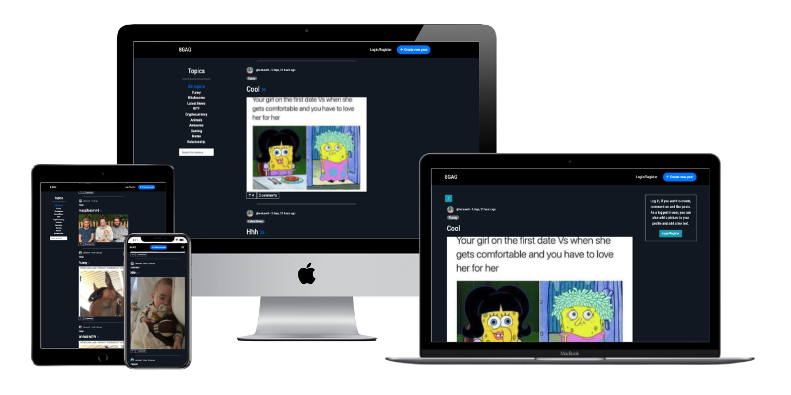
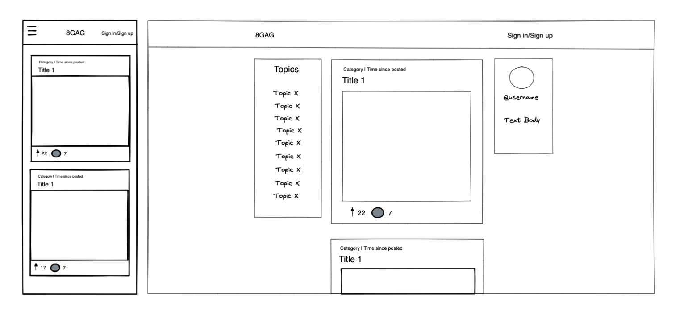
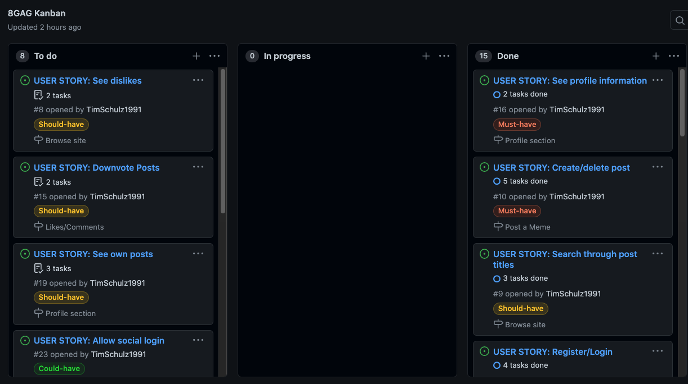

# 8GAG - [Live link](https://msp4-8gag.herokuapp.com/)

If you want to laugh and enjoy some good memes, you have come to the right place! 

8GAG is a fully responsive meme website, based on a very popular meme page called 9GAG. 
It is a place where users can create a profile, share their best memes, comment and like on other people's memes, or simply have a fun time.

# User Experience

## EPICs --> User Stories

(MH - Must Have, SH - Should Have, CH - Could Have)

### 1. User authentication/authorisation 
- As a site visitor, I want to be able to register/login with username/password to become a user, so that I can access special functionalities on the page (MH)
- As a site visitor, I want to be able to create an account with personal information about me, so that I have a personalized profile (MH)
- As a site visitor/user, I want to be constantly updated about my login status or informed about errors, so that I can see what state I am browsing the page in (MH)
- As a user, I want to be able to reset my password/username, so that I do not lose my account in case I forgot one of them (CH)
- As a site visitor, I can register or log in with my social accounts, so that I do not need to create a new account only for this page (CH)

### 2. Browse Site
- As a site visitor, I want to be able to browse the feed and see all the latest memes in chronological order, so that I can enjoy the page without being logged in (MH)
- As a site visitor, I want to be able to filter for certain categories of memes, so that I can only see memes that interest me (MH)
- As a site visitor, I want to be able to click on a post to see its comments, so that I can see what others have to say about the post (MH)
- As a site visitor, I want to see the number of likes/comments on each post in the feed, so that I can see right away if a meme is funny/popular (MH)
- As a site visitor, I can see dislikes on each post in the feed, so that I can see right away if other users did not like a meme (SH)
- As a site visitor, I can search for certain words in the post title, so that I can find very specific posts (SH)
- As a logged-in user, I can participate in chat rooms regarding certain topics, so that I can discuss with other users about a topic I am interested in (CH)

### 3. Post a Meme
- As a logged-in user, I want to be able to create and delete a post with a picture, so that I can share my memes with others (MH)
- As a logged-in user, I can also upload videos, so that I can enjoy and post funny videos too (CH)

### 4. Likes/Comments
- As a logged-in user, I want to be able to create and delete comments, so that I can interact with other people's memes (MH)
- As a logged-in user, I want to be able to like and unlike a post, so that I can interact with other people's memes and show them my appreciation (MH)
- As a logged-in user, I can downvote posts, to show that I dislike another meme (SH)

### 5. Profile Section
- As a logged-in user, I want to see my profile information in a special section next to the feed, so that I know I am logged it at first glance (MH)
- As a logged-in user, I want to be able to update my profile information (text about me and picture) to make my profile more individual (MH)
- As a logged-in user, I want to be able to delete my profile, so that the site has no stored information about me anymore (MH)
- As a logged-in user, I want to be able to click on my profile name and then be able to see all my recently posted memes (SH)
- As a logged-in user, I want to be able to click on other user's profile names and then be able to see all their public profile info and their latest posts (CH)

### 6. Admin Priviledges 
- As an admin/superuser, I want to be able to delete other users, posts and comments (MH)

In total, 14 user stories are a must-have (61%), 4 are should-have and 5 are could-have. 

## Design

### Color Scheme
The main colors used throughout the page are closely aligned to the dark colors of the 9GAG website (while browsing in dark mode). This makes the memes really "pop out" and puts them right into focus. 

- The navigation bar and the footer are black while the page background is kep in a very dark blue 
- Other elements follow the Bootstrap color scheme 
- The page is using blue buttons and icons for actions such as creating a new meme, going to a certain page or adding a comment
- Turquoise buttons and texts give the user valuable information about the page or let them perform actions regarding their profile
- Red buttons signal that a post/comment can be deleted

### Typography
A clean sans-serif font called 'Roboto Condensed', which is similar to the font used by 9GAG, has been used throughout the page in order to present the text in a clear, non-distracting way.

## Wireframes

The initially sketched wireframes of the page on desktop and mobile can be seen below. The final page ended up being very close to these mockups.

## Agile

For this project the GitHub Kanban agile project management tool was used to create EPICs, add User Stories to these EPICs and give each user story relevant tasks. 
Furthermore, each user story was labelled with a must-have, should-have or could-have tag. All must-have user stories have been finished throughout the project and even one should-have user story could be implemented. All remaining should-have and could-have stories could not be implemented due to time contraints, but will be great additions to build upon this page in the future. 

Throughout the development process, the stories (including their tasks) were constantly updated according to the progress and pushed into the right cloumn (in progress / done).

### Unfinished User Stories / Future Features
- Users should be able to downvote bad posts and this "dislike-counter" should be visible to all page visitors
- A user should be able to see all his recent posts, comments and likes in a "summary" section in his profile
- A user should be able to see all posts from another user, when clicking on their profile, and even be able to get in touch with them with a simple chat function
- A user should be able to reset their username/password
- A user should be able to sign up/log in with their social accounts (e.g. FB/Google)
- Users should be able to upload videos as well
- Users should be able to join discussion rooms regarding their favourite meme topics on the page